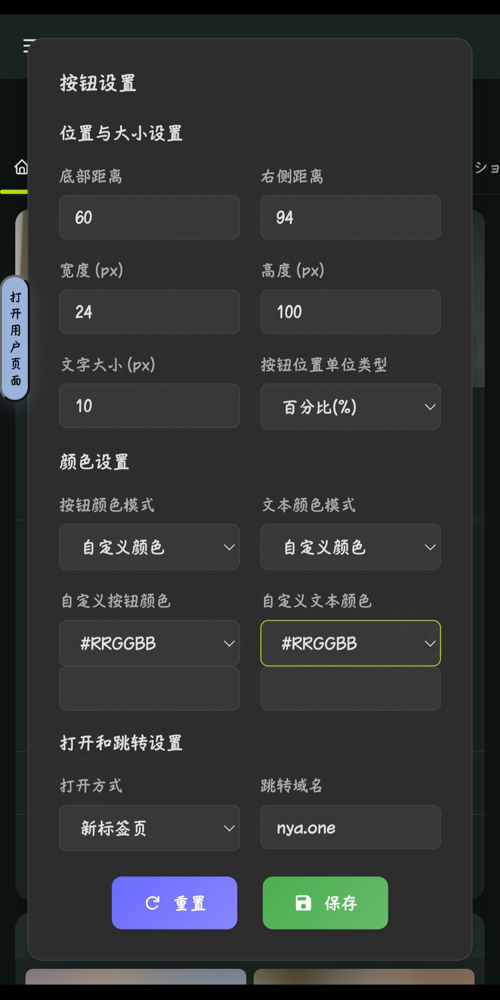
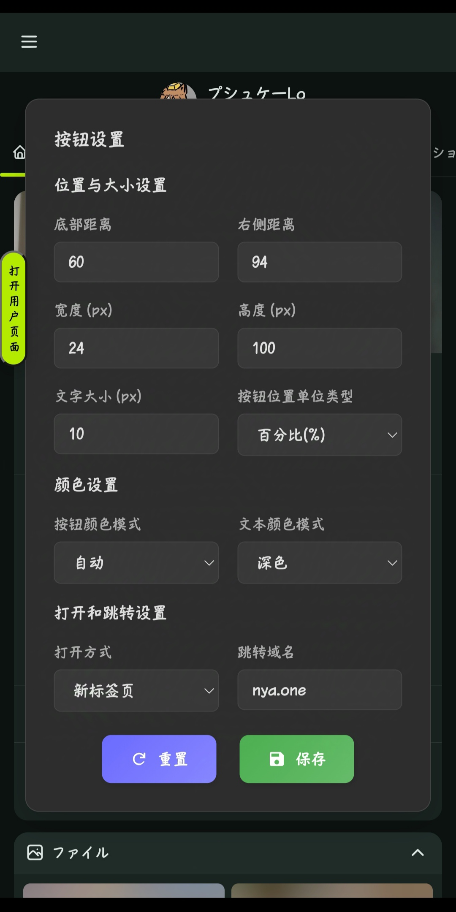

# Misskey-jump
[Misskey](misskey.io/) 增强工具
- [GitHub链接](https://github.com/YFTree/Misskey-jump)
- [更新链接](https://update.greasyfork.org/scripts/528474/Misskey服务器跳转.user.js)

功能预览：

1. 支持自定义服务器跳转
2. 按钮颜色自定义（默认自动识别主题色）
3. 支持识别链接关键词启用跳转按钮的功能
4. 自带设置菜单，更多设置项请查看源码（有中文标注）
5. 默认跳转域名为 [nya.one](nya.one)

~~你还在为需要关注的人在其他服务器而悲伤吗~~

截图：

